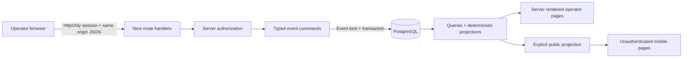

# Architecture

## Scope and runtime

One Next.js 16 App Router application, React 19, TypeScript, Tailwind CSS 4 and custom CSS; one PostgreSQL 17 database; Prisma 7 with the `@prisma/adapter-pg` driver adapter. Node 24 and pnpm 10. No external runtime service, AI provider, deployment platform or production KHLIM dependency.

This follows the [Next.js App Router model](https://nextjs.org/docs/app/getting-started) and [Prisma 7 driver adapter setup](https://www.prisma.io/docs/orm/v7). The lockfile fixes the exact dependency graph. The local database has a separate Docker volume and loopback-only port. There is no production deployment configuration.

## Code organization

- `src/lib/domain.ts`: pure fixture, standings, qualification, roster and score rules.
- `src/lib/csv.ts`: strict parsing, column mapping, row/group conflict validation.
- `src/lib/service.ts`: all operator event commands, transaction boundaries and reconciliation.
- `src/lib/query.ts`: database reads, active-result lookup, event phase, public allowlist.
- `src/lib/auth.ts`, `http.ts`: staff sessions, scrypt, request validation, authorization and errors.
- `src/app/api/`: JSON handlers. Every mutation requires staff authorization (except sign-in), checks Origin, validates input, and delegates to the service.
- `src/app/ops/`: staff dashboard and event operations. Unauthenticated requests redirect to sign-in.
- `src/app/events/`: public pages using only the public projection; draft events return 404.
- `prisma/`: explicit schema, SQL migration with constraints, synthetic seed.
- `tests/`: pure rules, real PostgreSQL integration, browser workflows.

## Persistence and concurrency

Every event command executes in one database transaction after acquiring `SELECT … FOR UPDATE` on its Event row. Imports, entry edits, check-in, scores, correction reconciliation, sign-off and publication therefore serialize per event. Different events are independent. Database constraints enforce unique event team names/seeds, pool names, slots, court/time slots, current result, distinct opponents and valid scores. Composite foreign keys prevent cross-event fixture and placement participants.

The result form supplies the exact current result ID (or null for first entry). A stale ID yields HTTP 409. Correction forms retain the ID they loaded even if the surrounding page refreshes. Concurrent first submissions cannot both succeed. The partial PostgreSQL unique index permits at most one CONFIRMED result per fixture, while retaining all historical revisions.

Read pages are dynamic and uncached. PostgreSQL reads are the source of truth; browser state is limited to unsaved forms, mapping selection and feedback. Restarting the app or opening a new DB connection recovers results, sessions, entries, standings inputs, import batches and placements. Pending CSV previews are durable in the database; the current UI asks the user to regenerate the preview after a refresh rather than offering a preview inbox.

## Command gates

| Action                       | Required state                                             | Result                                                                |
| ---------------------------- | ---------------------------------------------------------- | --------------------------------------------------------------------- |
| Save/import entries          | No fixtures                                                | Valid new roster, or edited roster with confirmation/check-in reset   |
| Confirm entry                | Valid 3–4 player roster                                    | Confirmation timestamp and actor audit                                |
| Check in                     | Entry confirmed; no fixtures                               | Team/player presence timestamp and actor audit                        |
| Generate schedule            | 8 confirmed teams, 4/pool, teams + 3 core players present  | 12 immutable pool games + 4 linked knockout slots; registration locks |
| Record score                 | Two qualified, distinct participants; valid unequal scores | Confirmed result; standings and descendants recomputed                |
| Correct score                | Exact previous revision + reason                           | New revision and correction; old score preserved                      |
| Resolve dangerous correction | Explicit authorized replay after conflict review           | Affected results voided; descendants repopulated; sign-off removed    |
| Confirm placements           | All 16 games have current results                          | Unique complete 1–8 order and sign-off timestamp                      |
| Publish results              | Generated and published schedule                           | Public scores/standings; signed-off placements if available           |

No result is stored as a client draft. Typing scores is an unsaved form; clicking Confirm creates the authoritative fact. An event phase is derived from its state; no independently editable phase flag can contradict the games.

## Correction algorithm

Inside the event transaction, supersede the previous result, append the replacement, and recompute pool tables. Once both pools finish, derive the semifinal participants; derive medal-game participants from semifinal winners/losers. Traverse SF-1, SF-2, FINAL, THIRD in dependency order.

When participants differ, an unplayed game can update directly. A played game is a conflict. The transaction simulates its removal to identify affected descendants. Without replay authorization, throw 409 and roll back **everything**, including the replacement result and any fixture changes. With authorization, mark each affected result VOIDED and append a correction record explaining the replay. Persist the reconciled participants. Keep all unaffected results.

Every score change deletes the current placement snapshot and clears sign-off, even if winners are unchanged. Public scores remain visible when already published, so public state reflects the corrected truth; final placements disappear until reconfirmed. There is no automatic quiet rewriting of played history and no option to keep contradictory results as current.

## Security boundary

The staff account is synthetic and intentionally public. Password hashes use random salts and scrypt. Random session tokens are stored only as SHA-256 hashes in PostgreSQL, expire after eight hours, and are revoked on sign-out. Cookies are HttpOnly/SameSite=Strict, and Secure when `APP_ORIGIN` is HTTPS. Local HTTP is the validated mode. Staff role is rechecked server-side on every command; there is no client-only authorization. POST handlers reject missing/foreign Origin and non-JSON content. Schemas restrict allowed fields, size and enum values. React renders user text without raw HTML.

The public projection explicitly selects fields rather than spreading database objects. A regression test caught internal roster data leaking through a standings spread; the derived Standing record now also selects only id/name/seed and computed values. Tests check both rendered public pages and serialized projections.

Lab shortcuts: shared staff role across lab events, a process-local login throttle, no account enrollment/recovery, no scoped organizational roles, no session administration UI and no production security certification. These are never migration candidates.

## Scheduling and operator UX

Times are persisted in UTC and displayed in Asia/Kuala_Lumpur (MYT). A date entered in the event form starts at 09:00 local time. Each pool owns a court; six sequential 15-minute games per court, with no overlaps. Semifinals are simultaneous at 11:00 on two courts; bronze is 11:30 on Court 1; final is 12:00 on Court 1. Pool fixture pairs use a three-round four-team rotation. Within-round games run sequentially on their pool's court.

The dashboard exposes completion gates and blockers. Staff can filter court schedules, enter scores with numeric keyboards, and explicitly correct existing results. Public navigation uses compact tables and vertically stacked bracket stages on mobile. Focus outlines, skip links, labeled forms, busy/disabled states and inline errors support keyboard use. Score values of zero render as `0`; absent results render as an em dash.

## Operational limitations

This experiment does not test physical-event officiating, connectivity outages, overtime rules, walkovers, weather delays or schedule adjustments. There is no queued offline mutation, polling or push feed; use Refresh. Roster edits and check-in lock when scheduling, so late substitutes require a different future policy. The app is single-process local-first, not a production incident, backup, retention or disaster-recovery design.
