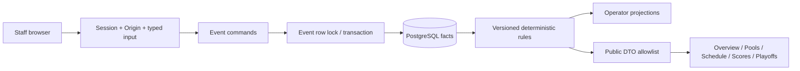

# Architecture

## Runtime and isolation

One Next.js 16 / React 19 / TypeScript application, Tailwind CSS 4 plus custom CSS, Prisma 7's PostgreSQL adapter and one local PostgreSQL 17 database. Node 24 and pnpm 10.15.0; dependencies remain lockfile-pinned. No new runtime dependency was added for this refinement. No Digital, Event Twin repository, FIBA service, AI provider, paid infrastructure or deployment integration.

## Module boundaries

| Module | Responsibility |
|---|---|
| `competition/format.ts` | CompetitionFormat validation, pool/game count preview, IANA wall-time conversion |
| `competition/draw.ts` | SeedingPolicy, reproducible RNG, balanced seeded-pot PoolDraw |
| `domain.ts` | Roster/score validation, arbitrary RoundRobinGenerator, versioned StandingsPolicy and WalkoverPolicy statistics |
| `competition/bracket.ts` | QualificationPolicy, cross-pool ranking, BracketGraph, bye positions, first-round opponent matching |
| `competition/schedule.ts` | Original schedule allocation and deterministic ScheduleProjection / EventTwinState impact calculation |
| `csv.ts` | ImportNormalizer: header inspection, aliases, long/wide layouts, typed rows and grouped conflicts |
| `service.ts` | Authorized transactional commands, materialization, revisions, graph reconciliation and approval gates |
| `query.ts` | Explicit event include, current-result selection, qualification and public/private projections |
| `auth.ts`, `http.ts` | Lab authentication, Origin/JSON checks, bounded requests and controlled errors |
| `src/components/` | Staff forms and public views; shared select CSS and time/statistics views |

Algorithms are pure where practical. The service supplies database facts, generated randomness and the actor, then persists typed decisions. It does not hide an entire event in JSON or let a UI bracket become a second result store.

## Authority and concurrency

Every event command authorizes EVENT_STAFF, acquires `SELECT … FOR UPDATE` on Event, and runs in one PostgreSQL transaction (60-second ceiling for bounded large imports/draws). Creation uses a nested atomic event/pool/audit write. Cross-event FK constraints scope fixtures, participants, placements and bracket sources. Unique indexes guard event names/seeds/slots, court/planned-time collisions, one active draw and one CONFIRMED result per fixture.

Concurrency tokens serve different reviewed decisions:

- Result entry/correction: exact current result ID or null. The browser retains the reviewed ID through refresh; stale writes return 409.
- Draw/redraw: expected latest draw version. Concurrent first draws cannot both succeed; redraw requires explicit consent and reason.
- Timing observation/recovery: event schedule revision. Observations, results and projection approval increment it. A stale proposal cannot be applied.
- CSV commit: batch ownership/status plus revalidation against current entries under the event lock. Explicit human confirmation is mandatory. Failed batches commit no teams.

Database records survive refresh/restarts. Forms hold only unsaved edits and feedback. Pending CSV previews persist, but the UI regenerates them after refresh; there is no preview inbox or offline queue.

## Important gates

| Command | Gate and effect |
|---|---|
| Save/import entries | No fixtures; valid complete roster and capacity. Invalidate active draw and clear derived assignments/seeds; edit resets that team's confirmation/presence. |
| Official draw | All entries eligible/confirmed; actual count supports format. Generate server randomness, snapshot inputs and commit all seeds/assignments atomically. |
| Redraw | No fixtures, expected version, explicit consent and reason; retain previous draw. No manual pool/seed selection API. |
| Generate fixtures | Active draw, balanced complete pool assignments, valid format and team/core-player check-in. Create pool fixtures and typed bracket edges. |
| Record played/walkover result | Two qualified distinct teams; valid score, exact revision; walkover requires a winner and reason. Reconcile descendants and withdraw placements. |
| Observe timing | Qualified participants, exact schedule revision, valid timestamps; append observation and update current actual timing. |
| Propose / approve recovery | Calculate impact without changing public estimates; apply only an explicit fresh approval. Preserve planned times. |
| Confirm placements | Every generated fixture has a current result; create the complete reviewed placement order. |
| Publish | Schedule required before results; hiding schedule also hides results. Public overview is independently controlled. |

## Generalized correction reconciliation

After appending a replacement revision, derive pool standings and the qualified list. Reproduce deterministic bracket slots, then traverse fixtures in topological round order. A source is QUALIFIER, upstream WINNER/LOSER, or POOL_RANK for migrated V1 fixtures. Resolve each side from the same confirmed facts.

If participants change, unstarted/unplayed fixtures update directly. Any result or actual start is a conflict. Simulate removing that game's current outcome so the traversal finds all affected descendants. Without replay authorization, throw 409 and roll back every attempted change. With explicit authorization, mark affected results VOIDED, append ResultCorrection records, clear current actual timing for replay, and materialize new participants. Preserve result snapshots, timing observations and unaffected games. Existing projected delays survive participant reconciliation.

Every result change withdraws current placement sign-off, including a score correction that leaves the winner unchanged. Published scores reflect the new current truth; final placements disappear until reviewed again. There is no option to keep a contradictory played descendant current.

## Planning and Event Twin foundation

Planning uses the configured start, court count, slot duration, court turnaround and minimum team rest. Circle-method pool fixtures are allocated greedily to the earliest available court. Pool play finishes before playoffs; later playoff rounds start only after the previous round plus rest. These conservative barriers also cover entrants not yet known. Planned times are immutable through the command API.

Live projection consumes current fixtures, approved estimates and actual observations. It propagates court occupancy, shared-team rest and round barriers, optionally adding a delay to the next unstarted game on a court. Completed/started games stay factual. Only unstarted games can receive later estimates, and no game is pulled earlier automatically. RecoveryProposal/RecoveryItem hold old/new estimates and the input schedule revision; approval records status/time and an actor-linked OperatorAction. This is the reusable pattern **state → disruption → impact → proposal → staff approval → public projection**, with no autonomous recovery.

Court outages, late teams and pauses can later supply additional constraints to this pure projector. This prototype does not solve them, optimize court swaps, enforce a venue closing time or integrate another Event Twin implementation.

## Security and privacy

All mutations require staff authorization on the server, including direct service calls. JSON handlers also enforce Origin and content type. Requests are bounded at 2 MB; imports at 1 MB/512 rows/100 columns. Lab sessions use salted scrypt passwords, hashed random tokens, expiry and HttpOnly/SameSite=Strict cookies. This public seeded account, shared event-wide role and process-local login throttle are disposable.

Public DTOs explicitly allow event facts, team names/pools/event seeds, published fixture/result summaries, computed team standings, announcements and approved placements. No roster names, individual ranking points, point provenance, staff identities, draw RNG, import rows, corrections, passwords or sessions are serialized publicly. Result publication and actual operational timing are separate: schedule can expose real start/end times while scores remain unpublished.

Shared form labels/focus, native selects with one inset chevron style, numeric score inputs, table-contained horizontal scrolling and stacked mobile playoff rounds support courtside use. Browser QA includes busy states, mapping races and stale correction forms, not just rendered screenshots.

## Migration compatibility

Migration 002 adds flexible policies and typed records, backfills planned projections, retains every old result, and marks old events LEGACY_V1. It converts V1 source labels to POOL_RANK/WINNER/LOSER edges without changing participants. Migrations 003–004 preserve individual-reference integrity while deferring intra-event FK checks so a full synthetic-event reset can finish its cascades. Migration 005 distinguishes an actual finish awaiting score confirmation from IN_PROGRESS.

Individual referenced pool/entry/source deletion still fails; only complete event deletion/reset is exposed by local scripts. These lab deletion semantics are not a production audit-retention policy.
