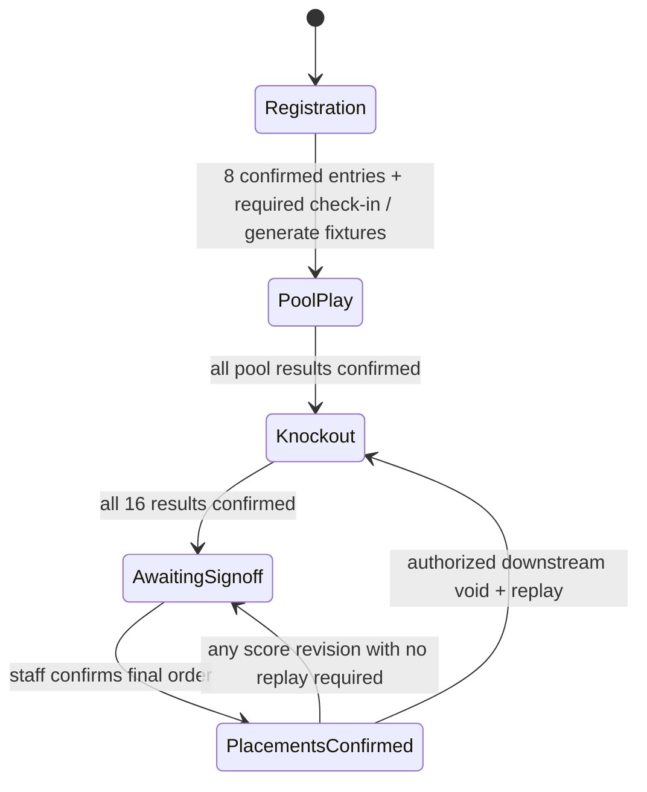
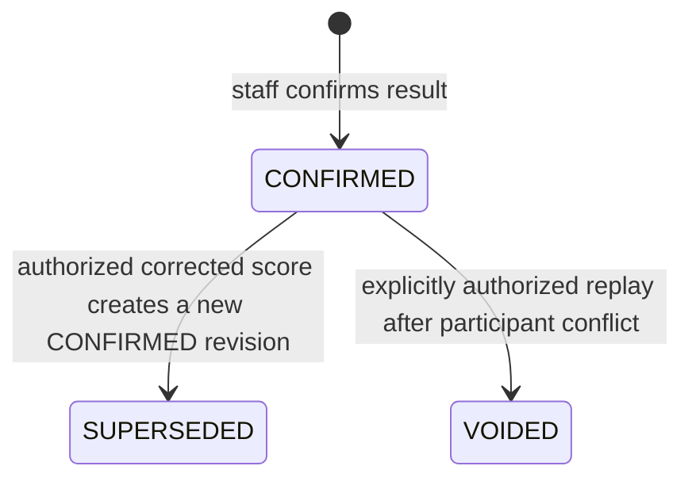

# Domain model and authoritative truth

This lab models a single benchmark: eight teams, two pools of four, three pool games per team, cross-pool semifinals, third-place game and final. It intentionally has no configurable format engine.

## Evaluated concepts

| Concept                   | Prototype representation                                       | Authority and reasoning                                                                                                                                                                                                                                       |
| ------------------------- | -------------------------------------------------------------- | ------------------------------------------------------------------------------------------------------------------------------------------------------------------------------------------------------------------------------------------------------------- |
| Event                     | `Event` record                                                 | Authoritative name/date/venue/overview/publication policy and final sign-off. Phase is derived.                                                                                                                                                               |
| Division / Pool           | Two `Pool` records                                             | Pools are distinct persisted records. A division entity adds nothing to the one-division benchmark and is omitted.                                                                                                                                            |
| Team                      | Name within `TeamEntry`                                        | No separate reusable club/team identity. An entry is this event's team snapshot. Future stable team identity may link to it without replacing the event fact.                                                                                                 |
| Registration / TeamEntry  | `TeamEntry`                                                    | Authoritative pool, unique seed priority, roster owner and confirmation. Fixed once fixtures exist.                                                                                                                                                           |
| RosterEntry / participant | `RosterEntry`                                                  | Event-local synthetic name and core/substitute slot. No separate athlete identity, birthday, contact or guardian record. Never migrate its ID as a production athlete ID.                                                                                     |
| CheckInRecord             | Timestamp on `TeamEntry` / `RosterEntry` plus `OperatorAction` | Current presence is durable; every toggle records staff/time in event audit. A separate typed immutable check-in ledger is deliberately deferred; audit subjects are human-readable names. Production should use typed subject links and attendance evidence. |
| Fixture / Game            | `Fixture`                                                      | Authoritative event, pool/stage, court, start time, distinct participants and advancement source labels. Pool fixtures are fixed; knockout assignments are transactionally maintained projections.                                                            |
| GameResult                | `GameResult` revision                                          | Authoritative confirmed score, participant snapshot, actor and timestamp. CONFIRMED/SUPERSEDED/VOIDED lifecycle. At most one current result per fixture.                                                                                                      |
| Standing                  | Pure `Standing` projection                                     | Derived only from CONFIRMED pool results. Never stored as independently editable points/wins totals. Public rows have an explicit field allowlist.                                                                                                            |
| Advancement               | Maintained knockout participant fields with source labels      | Derived from complete pool tables and semifinal outcomes. No unrelated manually entered winner record. Fixed source rules are encoded once for this benchmark. A reusable advancement-edge entity is deferred.                                                |
| EventPlacement            | `EventPlacement` + event sign-off                              | Authoritative reviewed snapshot of the derived final order. Withdrawn on any result revision; never quietly left stale.                                                                                                                                       |
| EventAnnouncement         | `EventAnnouncement`                                            | Authoritative public message, publication toggle and creation time. Staff actor is in the event action audit.                                                                                                                                                 |
| ResultCorrection          | `ResultCorrection`                                             | Authoritative previous result, optional replacement, reason, staff and time. Null replacement means explicit voiding for replay.                                                                                                                              |
| Import                    | `ImportBatch`, `ImportRow`                                     | Durable validated normalized rows and PREVIEW/COMMITTED lifecycle, source filename, row numbers, previewing/committing staff and timestamps. No opaque JSON tournament state.                                                                                 |
| Staff / Session           | `Staff`, `Session`                                             | Disposable lab authorization facts. Never production identities.                                                                                                                                                                                              |
| OperatorAction            | `OperatorAction`                                               | Staff/time/action/detail audit for event operations. Recent UI shows 30; the database retains all.                                                                                                                                                            |

## Invariants

- Event has pools A/B; generation requires exactly four entries in each, eight total.
- Seed priorities are unique event-wide integers 1–8. Team names are normalized by trim/collapse-whitespace/case folding for uniqueness.
- Roster has slots 1, 2, 3 and optionally 4. All names are nonempty (max 80 characters); duplicate normalized names within/across event rosters are rejected at save/import. Name matching is a lab conflict heuristic, not real identity resolution.
- Entry confirmation follows validation. Entry editing resets confirmation and all presence timestamps. Scheduling locks entries and check-in. All three core players and the team must be present; substitute attendance is optional.
- Games have distinct participants from the same event. Placeholder knockout games may have null participants until upstream results exist.
- Scores are whole integers 0–50, unequal, with both qualified participants present. This ceiling is an experiment guardrail, not FIBA rules. Draws/overtime must be resolved outside the prototype before entry. There are no forfeit semantics.
- No result is `null`/absent; a scored shutout is an actual result with a numeric zero. Tied 0–0 is invalid.
- A result's participant IDs snapshot the teams that actually played, so its history remains meaningful after a fixture is repopulated.
- An import is one transaction. Preview performs no team writes. Commit requires the matching staff-owned preview and explicit human confirmation; revalidate against current entries under lock. A stale or invalid batch creates zero entries. Already committed batches cannot be committed again.

## Standings and qualification policy

Ordering, in this exact sequence:

1. Wins, descending (a completed game gives one win or one loss).
2. Aggregate points scored minus points conceded, descending.
3. Aggregate points scored, descending.
4. Preassigned seed priority, ascending.

This is **not an official FIBA tiebreak implementation**. There is no head-to-head/mini-league rule. Seed priority is visible in entry review and public standings before play, editable only during registration, unique, and frozen with fixture generation. It is an explicit predeclared administrative tiebreak, not a silent alphabetical/UUID fallback. Rows display “seed tiebreak” when applicable. A unique seed makes the ordering total; invalid/nonunique seeds cannot be accepted, so no ambiguous qualifier is silently chosen.

Until all six games in each pool are confirmed, tables are provisional and semifinal participant slots remain unassigned. When all twelve pool games are confirmed, A1/B2 populate SF-1, B1/A2 populate SF-2. Standings regenerate from current results on each read; assignments reconcile within the score transaction.

Places 1–4 come from final winner/loser and third-place winner/loser. Places 5–8 compare nonqualifiers by pool finish (3rd before 4th), wins, difference, points scored, seed. These lower placements do not imply that the teams played each other.

## Lifecycles

Publication is orthogonal to operational phase. Staff can hide the event entirely, hide schedule/results, or publish scores while games are still running. Final placements require sign-off. Announcements can be hidden independently. Unpublishing schedule hides scores too, avoiding a public results view with no schedule.

A superseded/voided record is retained. Replacement/void provenance is in `ResultCorrection`. There is no button to edit old scores in place, manually set a semifinal qualifier or keep a contradictory result current.

## Mandatory correction example

With the sample pool scores, Amber has three wins. Black initially beats Lime 18–16 and has two wins, qualifying A2. Correcting to Black 16–18 Lime gives Lime two wins, moving Lime to A2 and Black to A3.

Before knockouts: update SF-2 (B1 versus A2) to Lime. After SF-2 has been played: identify that its participant snapshot conflicts. If its output fed played final/third games, they also conflict. Reject the first correction atomically; staff may explicitly void and replay those affected games. SF-1 remains intact. All histories retain the old teams/scores/actors/times/reasons. All placement sign-off is withdrawn.

A semifinal correction with the same teams but a changed winner similarly invalidates played medal descendants. A correction that changes only points without changing any downstream participants retains those games, but still requires fresh placement sign-off.
